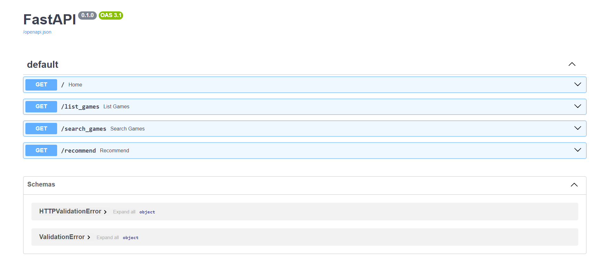

# Recomendação de games da Steam

Considerando o [dataset](https://www.kaggle.com/datasets/tamber/steam-video-games) disponível da Steam, faça um modelo de recomendação de filtro colaborativo baseado em itens, foi constrído uma API para interagir com este modelo.

O objetivo é que o usuário informe um nome de jogo e receba como retorno os 10 jogos mais similares. 

**Observação:** não há "avaliação/nota" (*rating*) direta dos jogos, de forma que é necessário calcular um *rating* implícito da seguinte pela seguinte fórmula: 

$$r_{\mathbf{ui}} = \frac{hours\ \mathbf{u}\ played\ in\ game\ \mathbf{i}}{total\ hours\ \mathbf{u}\ played}$$

ou seja, total de que o usuário jogou o game em relação ao total de horas jogados em todos os jogos.

---

## Tela FastAPI com opção de listagem, busca e recomendação

---

<i>Contato</i>  
 

